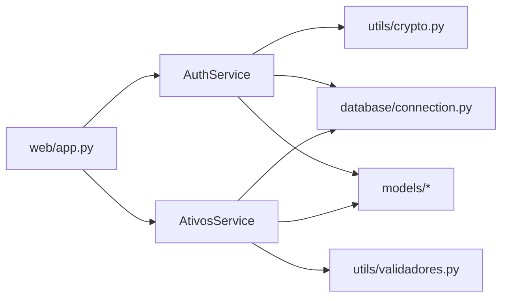

# C4 - Componentes

## Objetivo

Mostrar os componentes internos mais relevantes do backend.

## Leitura do diagrama

- `web/app.py` atua como ponto de entrada da camada Flask.
- `AuthService` concentra autenticação e recuperação.
- `AtivosService` concentra as operações do domínio de ativos.
- `crypto` e `validadores` sustentam regras de apoio reutilizáveis.
- `connection.py` mantém a integração com o banco isolada do restante do código.
