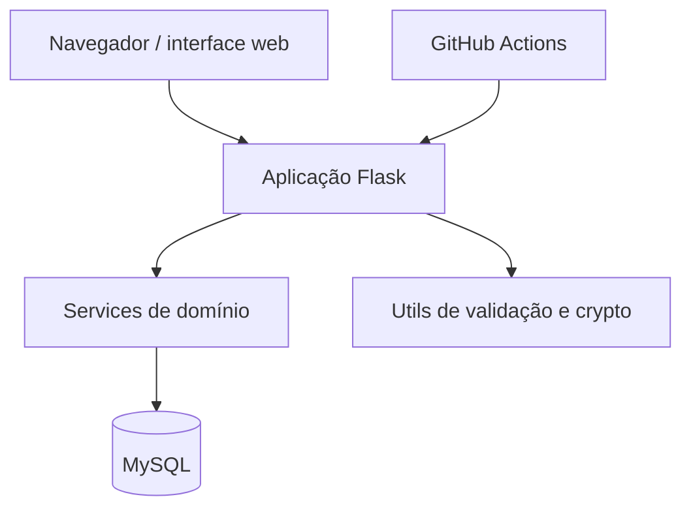

# C4 - Container

## Objetivo

Detalhar os principais containers lógicos do projeto.

## Leitura do diagrama

- A interface web conversa com a aplicação Flask.
- A lógica de negócio fica concentrada nos services.
- Validações e funções auxiliares permanecem em utils.
- O banco relacional sustenta a persistência.
