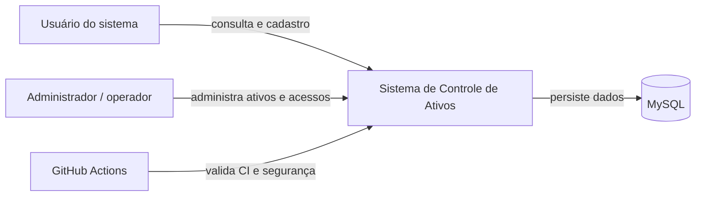

# C4 - Contexto

## Objetivo

Mostrar o sistema de Controle de Ativos no contexto do uso acadêmico e interno.

## Leitura do diagrama

- O sistema atende usuários autenticados e administradores operacionais.
- A persistência é feita em MySQL.
- A governança do repositório é reforçada por automação no GitHub.
